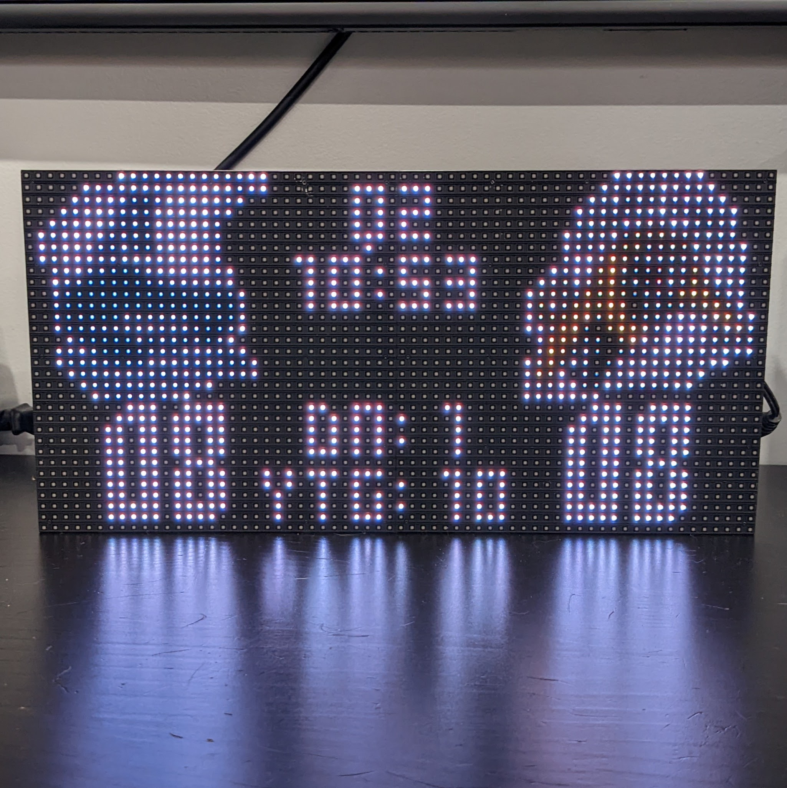

# cfl-led-scoreboard

Display your favourite CFL team score on an Raspberry Pi powered LED matrix. Currently supports 64x32 boards only.

__Note:__ A personal [CFL API key](https://api.cfl.ca/key-request) is required.

### Credit and inpsiration

This project was inspired by the following projects:

* [nhl-led-scoreboard](https://github.com/riffnshred/nhl-led-scoreboard)
* [nfl-led-scoreboard](https://github.com/mikemountain/nfl-led-scoreboard)
* [mlb-led-scoreboard](https://github.com/MLB-LED-Scoreboard/mlb-led-scoreboard) projects.

## Features (v0.2.x)

### GAME ROTATION

Hey, neat-o! You can rotate through multiple games now if you want to! Will still need some finessing, but definitely an improvement.

### Pregame Countdown

Currently shows the team logos and the game time or countdown.

### Live scoring updates

The score updates every X (`data_refresh_rate`) seconds. The scoreboard will display, from top to bottom: quarter, time remaining in quarter, team with possession, down and yards to gain, and the position of the line of scrimmage.  When a team is in the redzone, their name will light up red.

### Postgame

Just kind of looks like the pre-game screen but with the final scores. 

## Roadmap

* Test TD, FG, and other play display/rendering.
* Preseason spec.
* Playoff spec.
* Handle off-season.

## Installation

### Hardware Assembly

The [mlb-led-scoreboard guys made a great wiki page to cover the hardware part of the project](https://github.com/MLB-LED-Scoreboard/mlb-led-scoreboard/wiki). There's also this [very handy howchoo page](https://howchoo.com/g/otvjnwy4mji/diy-raspberry-pi-nhl-scoreboard-led-panel) which is what I mainly followed.

### Software Installation

#### Requirements

You need Git for cloning this repo and PIP for installing the scoreboard software.

```
sudo apt update
sudo apt install git python3-pip
```

#### Installing the software

This installation process might take some time because it will install all the dependencies listed below.

```
git clone --recursive https://github.com/sflems/cfl-led-scoreboard
cd cfl-led-scoreboard/
chmod +x scripts/install.sh
./scripts/install.sh
```

_Be sure to replace `your_api_key` with your personal API key_:

```
echo 'CFL_API_KEY = your_api_key' > .env
```

[rpi-rgb-led-matrix](https://github.com/hzeller/rpi-rgb-led-matrix/tree/master/bindings/python#building): The open-source library that allows the Raspberry Pi to render on the LED matrix.

[requests](https://requests.kennethreitz.org/en/master/): To call the API and manipulate the received data.

## Testing & Optimization (IMPORTANT)

If you have used a LED matrix on a raspberry pi before and know how to run it properly, then you can skip this part.

If you just bought your LED matrix and want to run this software right away, reference the [rpi-rgb-led-matrix library](https://github.com/hzeller/rpi-rgb-led-matrix/). Check out the section that uses the python bindings and run some of their examples on your screen. For sure you will face some issues at first, but don't worry, more than likely there's a solution you can find in their troubleshooting section.
Once you found out how to make it run smoothly, come back here and do what's next.

### Adafruit HAT/bonnet

If you are using any thing from raspberry pi 3+ to the newest versions with an Adafruit HAT or Bonnet, here's what [RiffnShred](https://github.com/riffnshred) did to run his board properly. It seems these are more recommendations than things you 100% absolutely need to do, but are probably beneficial anyway.

* Do the hardware mod found in the [Improving flicker section](https://github.com/hzeller/rpi-rgb-led-matrix#improving-flicker).
* Disable the on-board sound. You can find how to do it from the [Troubleshooting sections](https://github.com/hzeller/rpi-rgb-led-matrix#troubleshooting)
* From the same section, run the command that remove the bluetooth firmware, unless you use any bluetooth device with your pi.

Finally, here's the command he used.

```
sudo python3 main.py --led-gpio-mapping=adafruit-hat-pwm --led-brightness=60 --led-slowdown-gpio=2
```

## Usage

Open the `config.json` file from the root folder and change these values:

* ```teams``` Set this as your favourite team, or teams.

Now, in a terminal run this command.

```
cd ~/cfl-led-scoreboard/
sudo python3 main.py 
```

__If you run your screen on an Adafruit HAT or Bonnet, you need to supply this flag.__

```
sudo python3 main.py --led-gpio-mapping=adafruit-hat
```

__If you run your screen with the flicker mod installed.__

```
sudo python3 main.py --led-gpio-mapping=adafruit-hat-pwm
```

### Flags

Use the same flags used in the [rpi-rgb-led-matrix](https://github.com/hzeller/rpi-rgb-led-matrix/) library to configure your screen.

```
--led-rows                Display rows. 16 for 16x32, 32 for 32x32. (Default: 32)
--led-cols                Panel columns. Typically 32 or 64. (Default: 32)
--led-chain               Daisy-chained boards. (Default: 1)
--led-parallel            For Plus-models or RPi2: parallel chains. 1..3. (Default: 1)
--led-pwm-bits            Bits used for PWM. Range 1..11. (Default: 11)
--led-brightness          Sets brightness level. Range: 1..100. (Default: 100)
--led-gpio-mapping        Hardware Mapping: regular, adafruit-hat, adafruit-hat-pwm
--led-scan-mode           Progressive or interlaced scan. 0 = Progressive, 1 = Interlaced. (Default: 1)
--led-pwm-lsb-nanosecond  Base time-unit for the on-time in the lowest significant bit in nanoseconds. (Default: 130)
--led-show-refresh        Shows the current refresh rate of the LED panel.
--led-slowdown-gpio       Slow down writing to GPIO. Range: 0..4. (Default: 1)
--led-no-hardware-pulse   Don't use hardware pin-pulse generation.
--led-rgb-sequence        Switch if your matrix has led colors swapped. (Default: RGB)
--led-pixel-mapper        Apply pixel mappers. e.g Rotate:90, U-mapper
--led-row-addr-type       0 = default; 1 = AB-addressed panels. (Default: 0)
--led-multiplexing        Multiplexing type: 0 = direct; 1 = strip; 2 = checker; 3 = spiral; 4 = Z-strip; 5 = ZnMirrorZStripe; 6 = coreman; 7 = Kaler2Scan; 8 = ZStripeUneven. (Default: 0)
```

## Licensing

This project uses the GNU General Public License v3.0. If you intend to sell these, the code must remain open source and you at least have to tell people how cool I am (please, I need this).

***

## Disclaimers

* Rate limits for the CFL API are [30 requests per minute](https://api.cfl.ca/key-request#cb_limit_secret_key). While best efforts are made to ensure these limits are respected, various errors may cause these limits to by bypassed. As such we are not responsible for the loss of your CFL API key for any reason.
* Data accuracy is reliant on the CFL API being updated with up-to-date game data.
